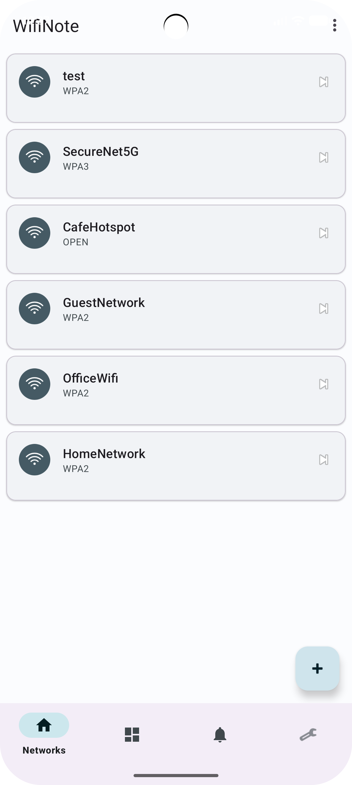
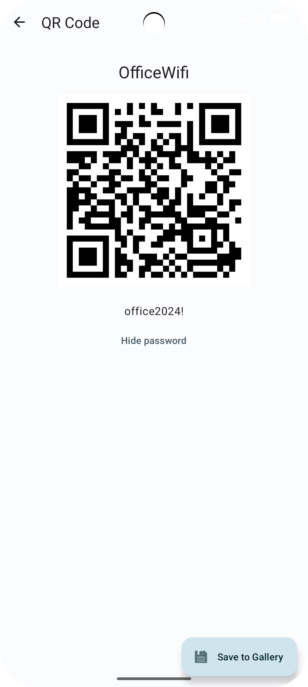
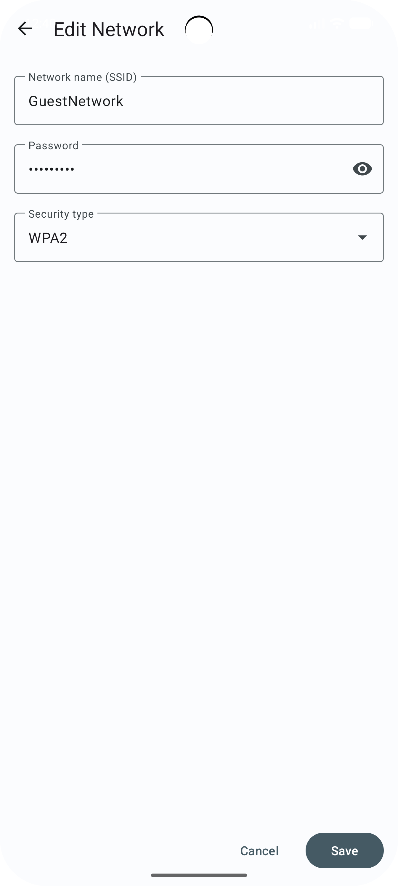
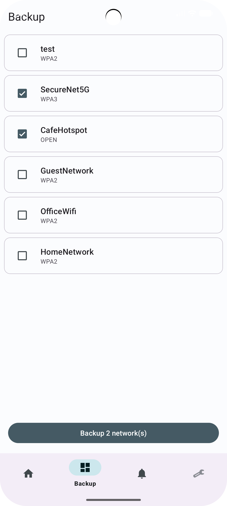
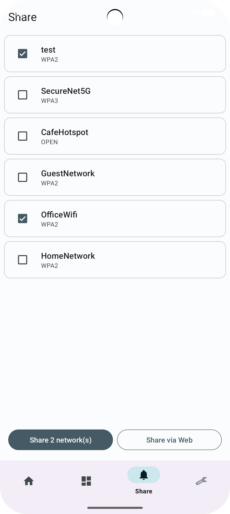
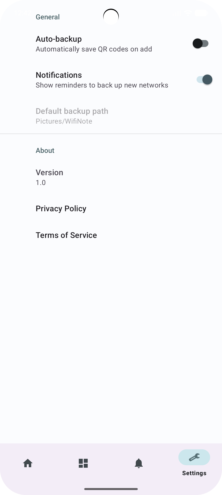

# WiFiNote

A local-first Android app for managing and sharing WiFi credentials via QR codes.

---

## Screenshots

| Networks | QR Detail | Edit Network |
|:---:|:---:|:---:|
|  |  |  |

| Backup | Share | Settings |
|:---:|:---:|:---:|
|  |  |  |

---

## Features

- **Credential store**, add, edit, and delete WiFi networks (SSID, password, security type). All data lives on-device in SQLite.
- **QR code generation**, each network produces a `WIFI:` QR code (WPA3-compatible) that any modern Android or iOS camera app can scan.
- **Save to gallery**, export a QR code as a PNG to the device photo library via MediaStore (scoped storage on API 29+).
- **Scan to add**, scan a printed or on-screen WiFi QR code with ML Kit to pre-fill the Add Network form.
- **Bulk backup**, select multiple networks on the Backup tab and export a QR PNG for each in one tap.
- **Share via Android**, send selected networks' credentials as text through any share-compatible app (Messages, email, etc.).
- **Share via Web**, upload credentials to [paste.rs](https://paste.rs) over HTTPS and receive a short URL, ready to copy.
- **Settings**, toggle auto-backup and notifications, view app version, and access privacy policy and terms.
- **First-launch onboarding**, permission request screen for camera and (API ≤28) storage access.
- **Material 3 + dark mode**, follows the system theme automatically.

---

## Tech Stack

- **Language:** Java 17
- **UI:** Android XML Views, Material 3 (`Theme.Material3.DayNight.NoActionBar`), View Binding
- **Navigation:** Jetpack Navigation Component 2.9.0, Bottom Navigation, NavHostFragment
- **Local storage:** SQLite via `DbHelper` + `NetworkContract` (no ORM)
- **QR generation:** ZXing Core (`com.google.zxing:core`)
- **QR scanning:** ML Kit Code Scanner (`com.google.android.gms:play-services-code-scanner`)
- **HTTP:** Retrofit 2.11.0 + OkHttp 4.12.0 (logging interceptor in DEBUG builds only)
- **Preferences:** AndroidX PreferenceFragmentCompat
- **Testing:** JUnit 4, OkHttp MockWebServer

---

## Build & Run

**Prerequisites:** Android Studio Meerkat (or later), JDK 17, Android SDK with API 36 platform.

```bash
# Clone
git clone https://github.com/Isaac-Piscopo/CIS2208-Mobile-Computing.git
cd CIS2208-Mobile-Computing

# Build debug APK
./gradlew assembleDebug

# Install on connected device / emulator (API 24+)
./gradlew installDebug
```

- **Min SDK:** 24 (Android 7.0 Nougat)
- **Target SDK:** 36 (Android 16)
- **Compile SDK:** 36

No API keys or external configuration required. The paste.rs endpoint is public and unauthenticated.

---

## Repository Structure

```
CIS2208-Mobile-Computing/
├── app/
│   ├── src/
│   │   ├── main/
│   │   │   ├── java/com/isaacpiscopo/wifinote/
│   │   │   │   ├── MainActivity.java
│   │   │   │   ├── OnboardingActivity.java
│   │   │   │   ├── EditNetworkActivity.java
│   │   │   │   ├── QrDetailActivity.java
│   │   │   │   ├── api/
│   │   │   │   │   ├── PasteApi.java
│   │   │   │   │   └── PasteRepository.java
│   │   │   │   ├── data/
│   │   │   │   │   ├── DbHelper.java
│   │   │   │   │   ├── NetworkContract.java
│   │   │   │   │   └── SeedData.java
│   │   │   │   ├── model/
│   │   │   │   │   └── Network.java
│   │   │   │   ├── ui/
│   │   │   │   │   ├── networks/
│   │   │   │   │   │   ├── NetworksFragment.java
│   │   │   │   │   │   ├── NetworksViewModel.java
│   │   │   │   │   │   ├── NetworksAdapter.java
│   │   │   │   │   │   └── SelectableNetworksAdapter.java
│   │   │   │   │   ├── backup/
│   │   │   │   │   │   ├── BackupFragment.java
│   │   │   │   │   │   └── BackupViewModel.java
│   │   │   │   │   ├── share/
│   │   │   │   │   │   ├── ShareFragment.java
│   │   │   │   │   │   └── ShareViewModel.java
│   │   │   │   │   └── settings/
│   │   │   │   │       ├── SettingsFragment.java
│   │   │   │   │       └── SettingsViewModel.java
│   │   │   │   └── util/
│   │   │   │       ├── QrScanHelper.java
│   │   │   │       └── QrUtils.java
│   │   │   └── res/
│   │   │       ├── layout/        # XML layouts (activity_*, fragment_*)
│   │   │       ├── navigation/    # mobile_navigation.xml
│   │   │       ├── values/        # strings, colors, themes
│   │   │       └── xml/           # preferences.xml
│   │   └── test/
│   │       └── java/com/isaacpiscopo/wifinote/
│   │           ├── api/
│   │           │   └── PasteRepositoryTest.java
│   │           └── data/
│   │               └── DbHelperTest.java
│   └── build.gradle
├── docs/
│   └── screenshots/               # PNG captures referenced above
├── gradle/
│   └── libs.versions.toml         # version catalog
└── README.md
```

---

## Version Management

Development follows a direct-to-`main` workflow, consistent with solo-developer practice. Each logical unit of work (a feature, a bug fix, or a structural change) is committed separately with a conventional-style message (`feat:`, `fix:`, `refactor:`, `test:`, `docs:`). This keeps the history linear and the blame output meaningful. No long-lived feature branches are used. Short-lived working branches are merged immediately. The full commit history is visible at:

<https://github.com/Isaac-Piscopo/CIS2208-Mobile-Computing/commits/main>

---

## Acknowledgements

Code completion assisted by GitHub Copilot.
